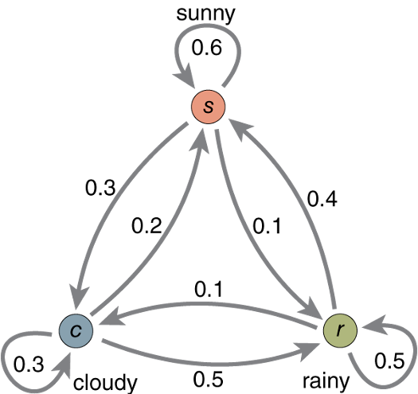

```{r setup, include=FALSE}
knitr::opts_chunk$set(echo = TRUE)

# Reproducible randomness
set.seed(191919)

source("functions.R")
```

## Discrete Markov processes

A (discrete-time) Markov chain (DTMC) is a sequence of random variables, known as a stochastic process, in which the value of the next variable depends only on the value of the current variable, and not any variables in the past.

At any given time the system is in one (and only one) of several *states*. We'll deal
with *homogeneous* MC, so transition between states are governed by constant probabilities which only depend on the current state (memorylessness, or Markovian property).

We copy the matrices encoding two examples seen during the lecture:

```{r }

# The weather example
weatherP <- matrix( c(0.6,  0.3,  0.1,
                      0.2,  0.3,  0.5,
                      0.4,  0.1,  0.5  ), 
                    nrow = 3, byrow = T)


# The "colored blocks" trajectory example
colortrajP <- matrix( c(3/5,  0,  2/5,
                        1/4, 3/4, 0,
                        1/4, 2/4, 1/4  ), 
                      nrow = 3, byrow = T)
```

Note how the rows sum to unity (conservation of probability): the state must
go somewhere.

For the sake of illustration, we work with the first ("weather") example.




## Sampling the chain

The simplest thing we can do is *sample* the chain, i.e.
follow the probabilities to obtain one realization (here for 30 steps).

```{r}
P <- weatherP

# Extract 30 time steps
sample.markov(P, 30)

```


## Stationary state


Question: if we play the game a very long time, what fraction of time would we spend in each state?

* That is the asymptotic (equilibrium) distribution.
* I.e., the probability of finding the system in a given state.


```{r}
# Check the stationary state by extracting 1000 samples
N <- 1000
sN <- sample.markov(P, N)
print(table(sN))
```

This is just an approximate, compute-intensive 
realization. The power of the Markov formalism lies
in the fact that such quantities can be computed from
the matrix *P* right away. For example,
the stationary distribution is computed
from the first eigenvector (see function `sstate`).

```{r}
ss <- sstate(P)
print(ss)
```

The exact estimate approximates well the samples.
We represent both graphically.

```{r}
plot(table(sN), xlab="State", ylab="Times visited")

# Compare with the theory
points(1:3, N*ss, col=2)
```

Stationary probabilities can be converted readily
into free energy differences (ΔG), up to an
irrelevant additive constant. Assuming *T* = 298 K,

```{r}
kB <- 0.001985875    # kcal/mol/K
dG <- kB * 298 * log(ss)
dG
```

in units of kcal/mol. It is convenient to set the lowest-energy 
state (the most stable) to 0 kcal/mol.

```{r}
dG-min(dG)
```


## Probability distributions

Markov chains can also be followed stochastically,
propagating the probability density. Again you will realize
that (under suitable conditions usually met), regardless 
of the initial state, the final probability distribution
converges towards the equilibrium one.

Of note, the "memory" of the initial state is lost after
a transient (related to the second eigenvalue).

```{r}

pT <- probs.markov(P, 8)
matplot(pT, type="o", 
        xlim = c(1,10),
        xlab="Time (starting from T=1)", 
        ylab="Probability of each state",
        main="Starting from state 1")
points(rep(10,3),ss,col=1:3)

pT <- probs.markov(P, 8, c(0,1,0))
matplot(pT, type="o", 
        xlim = c(1,10),
        xlab="Time (starting from T=1)", 
        ylab="Probability of each state",
        main="Starting from state 3")
points(rep(10,3),ss,col=1:3)

pT <- probs.markov(P, 8, c(0,0,1))
matplot(pT, type="o", 
        xlim = c(1,10),
        xlab="Time (starting from T=1)", 
        ylab="Probability of each state",
        main="Starting from state 3")
points(rep(10,3),ss,col=1:3)

```
